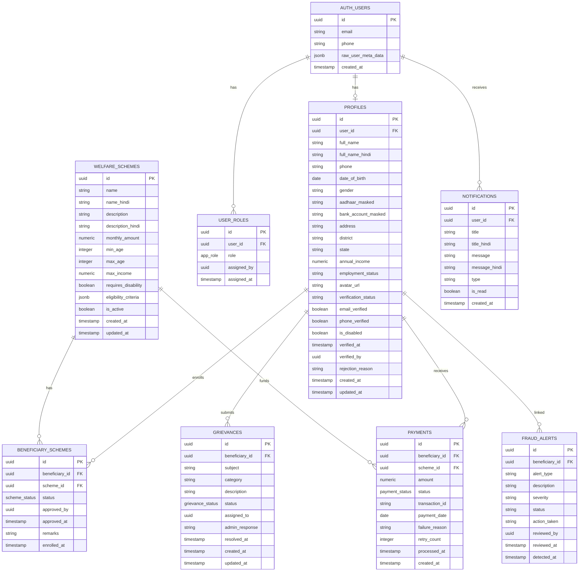
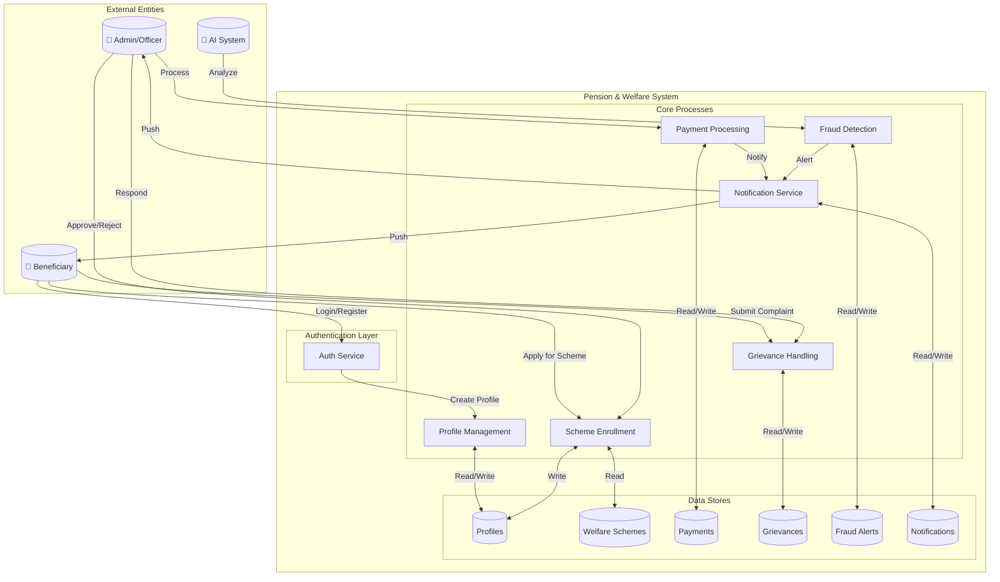

# Database Schema Diagram

## Entity Relationship Diagram

## Data Flow Diagram (Level 1)

## Enums

| Enum Name | Values |
|-----------|--------|
| `app_role` | `super_admin`, `scheme_officer`, `auditor`, `support_staff`, `beneficiary` |
| `scheme_status` | `pending`, `approved`, `rejected`, `suspended` |
| `payment_status` | `pending`, `processing`, `completed`, `failed`, `cancelled` |
| `grievance_status` | `submitted`, `under_review`, `in_progress`, `resolved`, `closed` |
| `beneficiary_status` | `active`, `inactive`, `suspended`, `deceased` |

## Key Relationships

1. **User → Profile**: One-to-one relationship via `user_id`
2. **User → Roles**: One-to-many (user can have multiple roles)
3. **Profile → Schemes**: Many-to-many via `beneficiary_schemes` junction table
4. **Profile → Payments**: One-to-many (beneficiary receives multiple payments)
5. **Profile → Grievances**: One-to-many (beneficiary can submit multiple grievances)
6. **Scheme → Payments**: One-to-many (scheme funds multiple payments)

## Security Model (RLS)

- **Profiles**: Users can only view/edit their own profile; admins can view all
- **Payments**: Users see own payments; admins manage all
- **Grievances**: Users CRUD own grievances; admins can respond
- **Schemes**: Public read for active schemes; admin-only management
- **Fraud Alerts**: Admin-only access
- **User Roles**: Users see own roles; super_admin manages all
